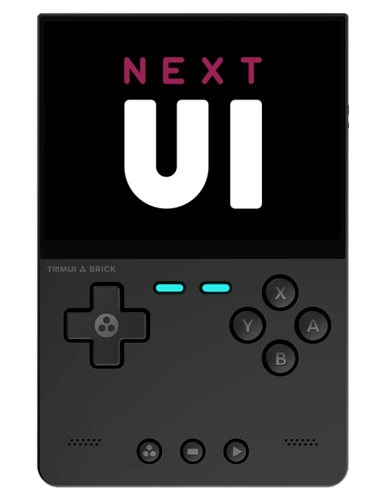
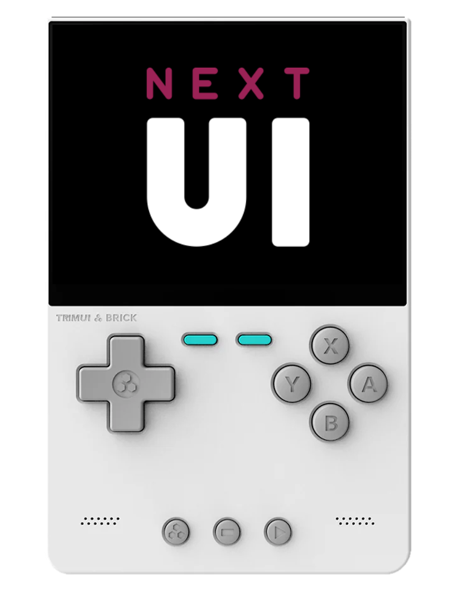

<!--suppress HtmlUnknownTarget -->

# **Welcome to the NextUI Docs!**

A powerful but understated CFW for supported TrimUI devices. [:simple-discord: Discord]({{ urls.discord }}) [:simple-github: GitHub]({{ urls.github }})

NextUI is a custom firmware for the TrimUI Brick, TrimUI Smart Pro, and TrimUI Smart Pro S retro handhelds. It keeps the simple launcher style of MinUI while adding device-specific features such as Wi-Fi, artwork, shaders, overlays, LEDs, a game switcher, game-time tracking, Paks, and RetroAchievements.

[Installation Instructions](getting-started/installation.md){ .md-button .md-button--primary }

---

## Start here

New to NextUI? Start with these pages:

- [Installation](getting-started/installation.md) for fresh SD-card setup.
- [Updating](getting-started/updating.md) for existing cards.
- [ROMs, BIOS, and Arcade](getting-started/roms.md) for exact folder names and file-placement rules.
- [Troubleshooting](support/troubleshooting.md) if the device boots to stock OS, only shows Tools, or a game will not launch.
- [Paks](paks.md) and [Pak Store](pak-store.md) for optional tools, emulators, PortMaster, file transfer, and save-sync utilities.

---

## Supported devices

See [Prerequisites](getting-started/index.md) for the list of supported devices and requirements.

---

## Features

NextUI features a rebuilt emulation engine and many handheld-focused additions:

- Rebuilt emulator core with screen-tearing and sync-stutter fixes, OpenGL/GPU rendering, dynamic CPU scaling, optimized cores, and low-latency audio/video through [libsamplerate](https://github.com/libsndfile/libsamplerate).
- Game switcher by [@frysee](https://github.com/frysee), scrolling titles, menu animations, and transition/color polish by [@radther](https://github.com/radther).
- Shaders and overlays, including shader presets/options, scanline defaults, PAL support, core-option categories, and compatibility work by [@bSr43](https://github.com/bSr43), [@DrFlarp](https://github.com/DrFlarp), and [@Pobega](https://github.com/Pobega).
- Rewind support and power-off protection by [@Helaas](https://github.com/Helaas).
- Deep sleep and suspend support by [@zhaofengli](https://github.com/zhaofengli), with suspend fixes by [@DrFlarp](https://github.com/DrFlarp), plus configurable screen and sleep timeouts.
- RetroAchievements integration and in-game notifications by [@clintonium-119](https://github.com/clintonium-119).
- Wi-Fi, Bluetooth, USB-C DAC support, automatic NTP time synchronization, timezone handling, and RTC support.
- Screenshots, Doom/PRBOOM support, Atari extras, and build/runtime improvements by [@josegonzalez](https://github.com/josegonzalez).
- Expanded extra emulator Paks by [@bSr43](https://github.com/bSr43) and [@cobaltgit](https://github.com/cobaltgit).
- Pak Store by [@brandonkowalski](https://github.com/brandonkowalski), plus community Paks for extra emulators, tools, PortMaster, file transfer, sync utilities, and more.
- Game artwork and media, game-time tracking, battery history, and battery time-left prediction.
- Cheats, broader ZIP support including BZ2/LZMA, and FBNeo screen rotation.
- Custom boot logos contributed by [@SolvalouArt](https://bsky.app/profile/solvalouart.bsky.social).
- Haptic feedback and rumble in the interface by [@ExonakiDev](https://github.com/exonakidev).
- Display controls for color temperature, brightness, contrast, saturation, and exposure.
- Configurable FN/Mute behavior, including night-mode display toggles and D-pad/analog/turbo switching.
- LED colors, effects, brightness, status indicators, and ambient LED mode on supported devices.
- CJK-capable Next font for Japanese, Chinese, and other ROM names.

---

## About NextUI

NextUI was started by Robin [@ro8inmorgan](https://github.com/ro8inmorgan) and [@frysee](https://github.com/frysee) as a fork of the popular MinUI CFW by [@shauninman](https://github.com/shauninman/MinUI).

---

## Discord Community

NextUI has a vibrant Discord community. Here you can talk about new and upcoming features, ask for help, and contribute to the community.

Many members produce custom Paks, overlays, and themes that add functionality to NextUI.

Don't be shy, come join us. [:simple-discord: Discord Invite]({{ urls.discord }})

---

## Kudos

Many minds make us whole. NextUI is a product of its community.

Special thanks to [@shauninman](https://github.com/shauninman) for MinUI, and to every contributor building firmware features, Paks, overlays, themes, testing notes, and support resources.
